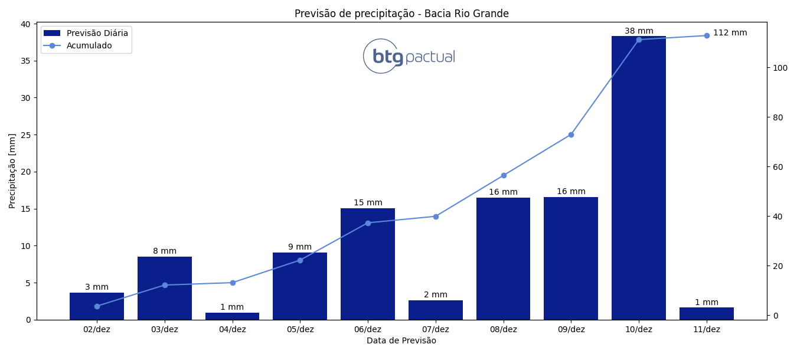

# BTG Pactual - Challenge
Desafio técnico p/ vaga de Engenheiro de Software - Mesa de Energia/Commodities

## Descrição da vaga
Time responsável pelo processamento diário de dados, que são utilizados em projetos que se estendem desde modelos preditivos de preço até plataformas realtime de dados meteorológicos.

Responsável pelo desenvolvimento, manutenção e evolução de projetos de alto valor agregado, que fornecem insights e informações extremamente estratégicas para os traders de commodities atuando em mercados globais.

## Instalação
Siga estas etapas para instalar e configurar o projeto em seu ambiente local.

### Pré-requisitos
Certifique-se de possuir:
 - Python - Versão X.X.X
 - Git - Versão X.X.X

1. Clonar repostiório
```
git clone https://github.com/viniciusparede/btg-challenge.git
```
2. Acessar diretório
```
cd btg-challenge
```
3. Instalar dependências
```
pip install -r requirements.txt
```
4. Executar
```
python main.py
```

## Documentação
A documentação foi divida em seções para entendimento do projeto, são elas:
 - [Compreensão do problema de negócio](docs/business_understanding.md)
 - [Compreensão dos dados](docs/data_understanding.md)
 - [Preparação dos dados](docs/data_preparation.md)
 - [Modelagem](docs/modeling.md)


## Resultado

